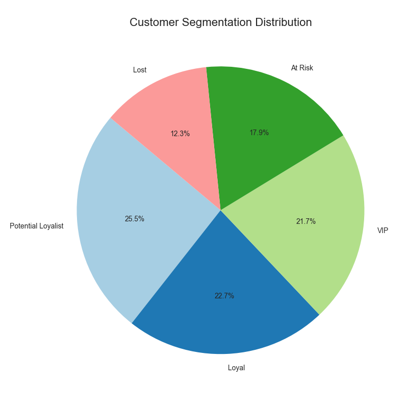
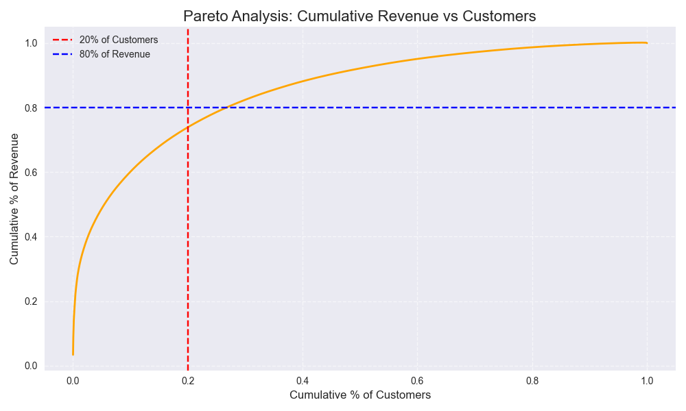

# 🛍️ UK Retail Sales Analysis & Customer Segmentation

This project analyzes over 540,000 transactions from a UK-based online retailer using Python.  
The main objective is to extract actionable insights from sales data through exploratory analysis, customer segmentation (RFM), and Pareto analysis.

---

## 📌 Project Goals

- Identify top-selling products and peak sales months
- Segment customers based on behavior (RFM)
- Discover high-value vs. low-value customers
- Use Pareto analysis to assess revenue concentration (80/20 rule)
- Provide data-driven business recommendations

---

## 📊 Dataset Information

- **Source**: [UCI Machine Learning Repository – Online Retail Dataset](https://archive.ics.uci.edu/dataset/352/online+retail)
- **Records**: 541,909
- **Features**: InvoiceNo, StockCode, Description, Quantity, InvoiceDate, UnitPrice, CustomerID, Country
- **Time Period**: Dec 2010 – Dec 2011

---

## 🧰 Tools & Libraries Used

- **Python** (Jupyter Notebook)
- `pandas`, `numpy`
- `matplotlib`, `seaborn`
- `openpyxl` (for Excel import)
- Git & GitHub (version control)

---

## 🔍 Analysis Workflow

### 1. Data Cleaning
- Removed missing values
- Excluded canceled transactions
- Created a new column: `SalesRevenue = Quantity × UnitPrice`
- Converted date formats and ensured correct types

### 2. Exploratory Data Analysis (EDA)
- 📦 Top 10 products by quantity sold
- 📆 Monthly revenue trends
- 🌍 Country-wise revenue (excluding UK)
- 💼 Top 10 customers by total revenue

### 3. RFM Segmentation
Used **Recency, Frequency, and Monetary** metrics to segment customers:
- Scored each metric from 1–5
- Combined into RFM Segment Codes (e.g., `545`, `112`)
- Labeled customers: `VIP`, `Loyal`, `Potential Loyalist`, `At Risk`, `Lost`

### 4. Pareto Analysis (80/20 Rule)
- Ranked customers by revenue
- Found that ~22% of customers contribute ~80% of total revenue
- Confirmed classic revenue concentration patterns

---

## 📈 Key Findings

| Insight | Details |
|--------|---------|
| 🛍️ Best-Selling Product | "WORLD WAR 2 GLIDERS ASSTD DESIGNS" |
| 💰 Top Customer Revenue | £279,489 |
| 🌍 Top Countries (Ex-UK) | Netherlands, EIRE, Germany |
| 📆 Peak Months | November and December |
| 🧠 Pareto Rule | Top 22% of customers contribute 80%+ of revenue |
| 📊 Segment Sizes | 25.5% Potential Loyalists, 22.7% Loyal, 21.7% VIP, 17.9% At Risk, 12.3% Lost |

---

## 📢 Business Recommendations

- Prioritize VIPs and Loyal customers for retention efforts
- Use targeted win-back campaigns for At Risk segments
- Expand marketing in countries like Netherlands and Ireland
- Align stock & promotions with Q4 holiday season peaks

---

## 📸 Sample Visuals

| Segment Distribution (Pie Chart) | Revenue Concentration (Pareto Chart) |
|:----------------------------------:|:--------------------------------------:|
|  |  |

---

## 📂 Folder Structure

